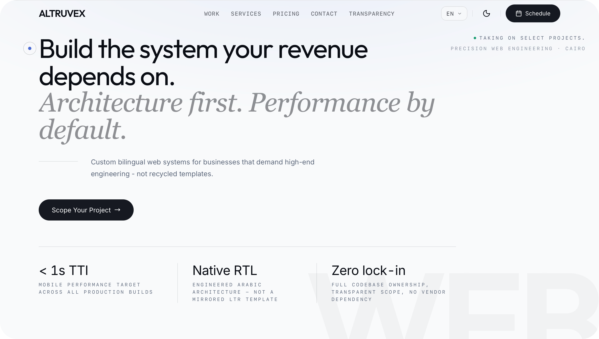

  

  

# Altruvex

## Build the system your revenue depends on.

Altruvex builds custom bilingual web systems for companies that need their website to become a business asset - not a digital brochure.

Most websites do not fail because they look bad. They fail because the buyer does not understand the offer fast enough. Altruvex fixes the structure underneath: positioning, hierarchy, interface, bilingual behavior, performance, and ownership.

---

## What We Sell

| Service                            | Business Value                                                     |
| ---------------------------------- | ------------------------------------------------------------------ |
| Custom web applications            | Turn real business logic into reliable digital systems.            |
| Conversion-focused websites        | Make the offer clearer and move buyers toward action.              |
| E-commerce experiences             | Improve product discovery, mobile speed, and buying flow.          |
| Bilingual Arabic / English systems | Serve Arabic and English audiences with equal quality.             |
| Technical audits and rescues       | Find what is hurting speed, trust, conversion, or maintainability. |

---

## Why Altruvex

<table>
  <tr>
    <td width="50%" valign="top">
      <h3>Architecture Comes First</h3>
      
Before design or code, we map the offer, audience, content hierarchy, conversion path, and technical constraints.

    </td>
    <td width="50%" valign="top">
      <h3>Performance Is Product Quality</h3>
      
Speed affects trust, search visibility, and conversion. It is part of the build from day one - not a late optimization task.

    </td>
  </tr>
  <tr>
    <td width="50%" valign="top">
      <h3>Arabic Is Not an Afterthought</h3>
      
RTL is treated as a first-class interface direction. Layout, rhythm, spacing, and navigation are reconsidered for Arabic - not mirrored from LTR.

    </td>
    <td width="50%" valign="top">
      <h3>No Lock-In</h3>
      
The client receives a real codebase, clear documentation, and full ownership. No vendor dependency. No plugin fragility.

    </td>
  </tr>
</table>

---

## Who It Is For

- Service businesses that need stronger lead generation
- B2B companies that need clearer positioning
- E-commerce brands that need speed and conversion
- Companies serving Arabic and English audiences
- Founders launching high-quality digital products
- Teams replacing slow, outdated, or template-based websites

---

## How We Work

| Phase    | Purpose                                                                                      | Outcome                                                |
| -------- | -------------------------------------------------------------------------------------------- | ------------------------------------------------------ |
| Diagnose | Understand the business, audience, offer, constraints, and friction.                         | A clear view of what the website must accomplish.      |
| Define   | Map the structure, content hierarchy, conversion path, and technical approach.               | A scope that can be built without vague middle ground. |
| Build    | Design and develop with bilingual precision, performance discipline, and commercial clarity. | A production-ready web system.                         |
| Launch   | Ship with deployment, documentation, and ownership transfer.                                 | A live system the business can operate and grow.       |

---

## Brand Principles

| Principle                 | Meaning                                                                               |
| ------------------------- | ------------------------------------------------------------------------------------- |
| Clarity over decoration   | Design exists to make the offer easier to understand and easier to trust.             |
| Engineering over assembly | The work is built around the business - not assembled from generic blocks.            |
| Proof over claims         | Performance, structure, and case studies demonstrate the standard.                    |
| Ownership over dependency | Clients leave with a system they own and understand.                                  |
| Bilingual by design       | Arabic and English users deserve equal quality - by architecture, not by translation. |

---

## The Standard

Every project is judged against:

- Clear positioning and strong first impression
- Fast mobile performance - target < 1s TTI
- Native RTL/LTR - engineered, not mirrored
- Conversion-focused page structure
- Reliable forms and lead capture
- Search-friendly metadata and content structure
- Clean technical architecture and full maintainability

---

  <strong>Altruvex · Precision Web Engineering · Cairo</strong> 
  <a href="https://altruvex.com">altruvex.com</a>

